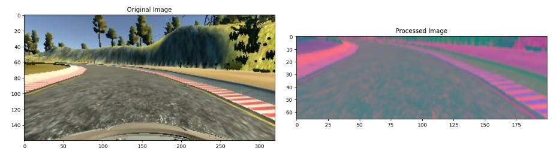
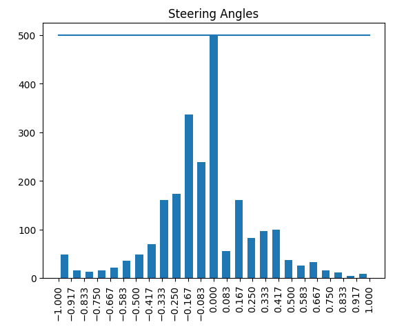

# Self-Driving Car Simulation using CNN

This project simulates a self-driving car using a Convolutional Neural Network (CNN). It uses images collected from a Unity-based driving simulator where the car is manually driven by a user. The collected dataset is then preprocessed and used to train a deep learning model that can drive the car autonomously based on road images.

📌 Project Overview
* User drives a car in a Unity simulation to collect road data.
* Captured frames and corresponding steering angles form the dataset.
* Data analysis and preprocessing done using Pandas, NumPy, Matplotlib, and Seaborn.
* CNN model trained to predict steering direction based on input images.
* Trained model used to autonomously control the vehicle in the simulation.

| Tool/Library            | Purpose                                |
| ----------------------- | -------------------------------------- |
| **Python**              | Core programming language              |
| **TensorFlow/Keras**    | CNN model building and training        |
| **OpenCV**              | Image preprocessing and manipulation   |
| **Unity**               | Driving simulation and data collection |
| **Pandas, NumPy**       | Data handling and manipulation         |
| **Matplotlib, Seaborn** | Data visualization and analytics       |
